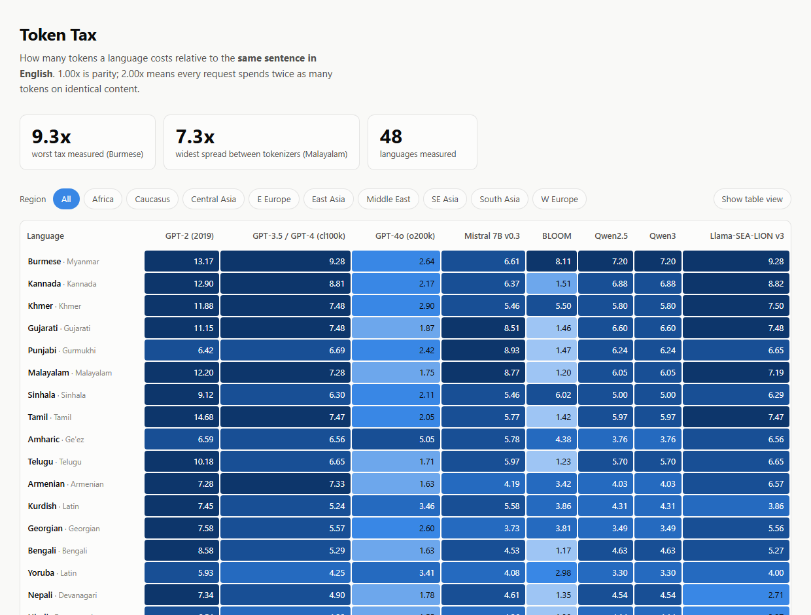

# tokentax

**How much extra do you pay to prompt an LLM in your own language?**

Same sentence, same meaning, different language — and wildly different token
counts. `tokentax` measures that gap across LLM tokenizers using a
human-translated parallel corpus, so the only variable is the tokenizer.

**48 languages, 23 writing systems, 9 tokenizers.** Runs on a laptop: no GPU, no
model weights, no API keys — tokenizers only.

📊 **[Interactive results →](https://tang-vu.github.io/tokentax/)**

[](https://tang-vu.github.io/tokentax/)

## What the data says

**A Burmese speaker can pay 9.3x for the same content.** Not on a museum piece —
on Llama-SEA-LION v3, a model built for Southeast Asia. It is also the most
expensive tokenizer measured for Khmer. A model named for a region is not
automatically good at that region's languages.

**The gap between tokenizers is bigger than most people's entire optimisation
budget.** Malayalam costs 1.20x on BLOOM and 8.77x on Mistral 7B v0.3 — a
**7.3x** difference for identical text, decided entirely by which tokenizer you
picked. Punjabi, Gujarati, Kannada, Telugu, and Tamil all show gaps above 5x.

**Some languages have no good option.** Amharic's cheapest tokenizer still costs
3.76x. Kurdish 3.46x, Yoruba 2.98x, Khmer 2.90x, Burmese 2.64x. For these,
switching vendors does not rescue you — nobody has built a vocabulary that
covers them.

**There is no universal winner.** BLOOM and GPT-4o are each cheapest for 20 of
48 languages, and BLOOM is the *most expensive* for 8 others. Mistral v0.3 and
cl100k are each worst for 17. Pick by your language, not by reputation.

**Rebuilding the vocabulary works — dramatically.** Between OpenAI's cl100k and
o200k, the same content got 4.5x cheaper in Armenian, 4.2x in Malayalam, 4.1x in
Kannada. This is a solvable problem, and vendors solve it when they choose to.

**A few languages beat English.** Chinese, Indonesian, and Malay all dip below
1.00x on their best tokenizer. Dense scripts win when the vocabulary covers them.

**Vietnamese**, for the curious: 2.25x on Mistral, 1.93x on cl100k, down to
1.04x on BLOOM and 1.16x on SEA-LION. PhoBERT, trained only on Vietnamese,
reaches 0.76x — you cannot bolt it onto a general model, but it shows how much
headroom the multilingual tokenizers leave on the table.

Full matrix, per-tokenizer detail, effective-context tables:
[`results/token-tax.md`](results/token-tax.md) ·
[raw JSON](results/token-tax.json)

## Why it matters

Token tax compounds into three real costs:

- **Bill.** APIs charge per token. A 2x tax is a 2x invoice for identical work.
- **Context.** A nominal 128k window holds only ~14k tokens' worth of English
  content when you write Burmese at 9.28x.
- **Latency.** More tokens per request means slower first token and slower
  generation.

## Usage

```bash
pip install -e .

tokentax list                          # tokenizers, languages, regions
tokentax bench                         # everything, 500 pairs per language
tokentax bench --languages vi,th,ta    # specific languages
tokentax bench --languages Africa      # or a whole region
tokentax bench --tokenizers o200k,qwen3 --samples 1000
tokentax bench --tokenizers all+gated  # include Llama/Gemma (needs HF login)
tokentax render                        # rebuild reports from existing JSON
```

`bench` writes `token-tax.md`, `token-tax.json`, and `index.html` to `--out`
(default `results/`).

## How it stays honest

Benchmarks are easy to accidentally rig. Four things guard against it:

**Aligned translations.** Every ratio compares the same sentence in both
languages, from [OPUS-100](https://huggingface.co/datasets/Helsinki-NLP/opus-100).
Counting tokens on unrelated texts would measure the texts, not the tokenizer.

**Lossy encodings are disqualified.** A tokenizer that cannot represent a script
emits `<unk>` and posts a token count for text it has already mangled. PhoBERT
scores 2.12x on Thai — mid-table, and meaningless, because 3.5% of those tokens
are `<unk>` and the Thai is disintegrating into characters. Cells above 1%
unknown tokens are flagged and excluded from rankings.

**Historical baselines don't pad the rankings.** GPT-2 is the worst option for
all 48 languages. Leaving it in the "most expensive" column would be true and
useless, so it appears in the matrix as a reference point only.

**Low-resource languages aren't quietly dropped.** Some OPUS-100 pairs ship no
held-out split. Skipping them would bias the benchmark toward well-resourced
languages — the exact bias it exists to measure — so those languages fall back
to another split and every report names them.

Full methodology and limitations:
[`docs/methodology-and-limitations.md`](docs/methodology-and-limitations.md).

Tokenizer efficiency is **not** model quality. A cheap tokenizer attached to a
weak model is still a bad choice.

## Adding a tokenizer or language

Both are one entry each — no other code changes.

A tokenizer, in `src/tokentax/tokenizer_registry.py`:

```python
TokenizerSpec(
    key="my-model",
    label="My Model",
    backend="hf",                  # or "tiktoken"
    ref="org/my-model",            # HF repo id, or tiktoken encoding name
    family="Org",
    vocab_note="64k BPE",
    # languages=("vi",)            # only for monolingual tokenizers
)
```

A language, in `src/tokentax/languages.py` — any of OPUS-100's ~100 languages:

```python
Language("so", "Somali", "Latin", "Africa")
```

Then `tokentax bench --languages so --tokenizers my-model` and open a PR.
Results for underrepresented languages are especially welcome — the gaps above
are worst exactly where measurement is thinnest.

## Development

```bash
pip install -e ".[dev]"
pytest
```

The suite uses fake tokenizers throughout, so it runs offline in under a second.

## License

MIT
